---
## Front matter
title: "Лабораторная работа №6 по предмету Операционные системы"
subtitle: "Группа НПМбв-02-19"
author: "Воронцов Павел Васильевич"

## Generic otions
lang: ru-RU
toc-title: "Содержание"

## Bibliography
bibliography: bib/cite.bib
csl: pandoc/csl/gost-r-7-0-5-2008-numeric.csl

## Pdf output format
toc: true # Table of contents
toc-depth: 2
lof: true # List of figures
lot: true # List of tables
fontsize: 12pt
linestretch: 1.5
papersize: a4
documentclass: scrreprt
## I18n polyglossia
polyglossia-lang:
  name: russian
polyglossia-otherlangs:
  name: english
## I18n babel
babel-lang: russian
babel-otherlangs: english
## Fonts
mainfont: PT Serif
romanfont: PT Serif
sansfont: PT Sans
monofont: PT Mono
mainfontoptions: Ligatures=TeX
romanfontoptions: Ligatures=TeX
sansfontoptions: Ligatures=TeX,Scale=MatchLowercase
monofontoptions: Scale=MatchLowercase,Scale=0.9
## Biblatex
biblatex: true
biblio-style: "gost-numeric"
biblatexoptions:
  - parentracker=true
  - backend=biber
  - hyperref=auto
  - language=auto
  - autolang=other*
  - citestyle=gost-numeric
## Pandoc-crossref LaTeX customization
figureTitle: ""
tableTitle: "Таблица"
listingTitle: "Листинг"
lofTitle: "Список иллюстраций"
lotTitle: "Список таблиц"
lolTitle: "Листинги"
## Misc options
indent: true
header-includes:
  - \usepackage{indentfirst}
  - \usepackage{float} # keep figures where there are in the text
  - \floatplacement{figure}{H} # keep figures where there are in the text
---

# Цель работы

Ознакомление с файловой системой Linux, её структурой, именами и содержанием каталогов. Приобретение практических навыков по применению команд для работы с файлами и каталогами, по управлению процессами (и работами), по проверке использования диска и обслуживанию файловой системы.

# Задание

1. Выполните все примеры, приведённые в первой части описания лабораторной работы.

2. Выполните следующие действия, зафиксировав в отчёте по лабораторной работе используемые при этом команды и результаты их выполнения:\
2.1. Скопируйте файл /usr/include/sys/io.h в домашний каталог и назовите его equipment. Если файла io.h нет, то используйте любой другой файл в каталоге /usr/include/sys/ вместо него.\
2.2. В домашнем каталоге создайте директорию ~/ski.plases.\
2.3. Переместите файл equipment в каталог ~/ski.plases.\
2.4. Переименуйте файл ~/ski.plases/equipment в ~/ski.plases/equiplist.\
2.5. Создайте в домашнем каталоге файл abc1 и скопируйте его в каталог ~/ski.plases, назовите его equiplist2.\
2.6. Создайте каталог с именем equipment в каталоге ~/ski.plases.\
2.7. Переместите файлы ~/ski.plases/equiplist и equiplist2 в каталог ~/ski.plases/equipment.\
2.8. Создайте и переместите каталог ~/newdir в каталог ~/ski.plases и назовите его plans.

3. Определите опции команды chmod, необходимые для того, чтобы присвоить перечисленным ниже файлам выделенные права доступа, считая, что в начале таких прав нет:\
3.1. drwxr--r-- ... australia\
3.2. drwx--x--x ... play\
3.3. -r-xr--r-- ... my_os\
3.4. -rw-rw-r-- ... feathers\
При необходимости создайте нужные файлы.

4. Проделайте приведённые ниже упражнения, записывая в отчёт по лабораторной работе используемые при этом команды:\
4.1. Просмотрите содержимое файла /etc/password.\
4.2. Скопируйте файл ~/feathers в файл ~/file.old.\
4.3. Переместите файл ~/file.old в каталог ~/play.\
4.4. Скопируйте каталог ~/play в каталог ~/fun.\
4.5. Переместите каталог ~/fun в каталог ~/play и назовите его games.\
4.6. Лишите владельца файла ~/feathers права на чтение.\
4.7. Что произойдёт, если вы попытаетесь просмотреть файл ~/feathers командой cat?\
4.8. Что произойдёт, если вы попытаетесь скопировать файл ~/feathers?\
4.9. Дайте владельцу файла ~/feathers право на чтение.\
4.10. Лишите владельца каталога ~/play права на выполнение.\
4.11. Перейдите в каталог ~/play. Что произошло?\
4.12. Дайте владельцу каталога ~/play право на выполнение.

5. Прочитайте man по командам mount, fsck, mkfs, kill и кратко их охарактеризуйте, приведя примеры.

# Выполнение лабораторной работы
## Пункт 1

Выполните все примеры, приведённые в первой части описания лабораторной работы.

Копирование файла в текущем каталоге. Скопировать файл ~/abc1 в файл april и в файл may (рис. 1):\
cd\
touch abc1\
cp abc1 april\
cp abc1 may

Копирование нескольких файлов в каталог. Скопировать файлы april и may в каталог monthly (рис. 2):\
mkdir monthly\
cp april may monthly

Копирование файлов в произвольном каталоге. Скопировать файл monthly/may в файл с именем june (рис. 3):\
cp monthly/may monthly/june\
ls monthly

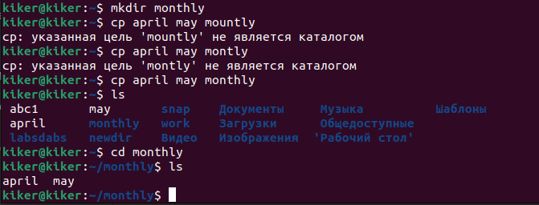

Копирование каталогов в текущем каталоге. Скопировать каталог monthly в каталог monthly.00 (рис. 4):\
mkdir monthly.00\
cp -r monthly monthly.00

Копирование каталогов в произвольном каталоге. Скопировать каталог
monthly.00 в каталог /tmp\ (рис. 5)\
cp -r monthly.00 /tmp

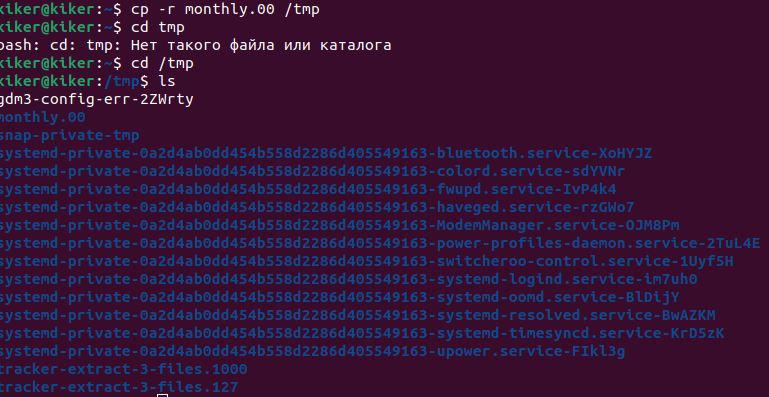

Переименование файлов в текущем каталоге. Изменить название файла april на july в домашнем каталоге (рис. 6)\
cd\
mv april july

Перемещение файлов в другой каталог. Переместить файл july в каталог (рис. 7)\
monthly.00:\
mv july monthly.00\
ls monthly.00

Переименование каталогов в текущем каталоге. Переименовать каталог (рис. 8)\
monthly.00 в monthly.01\
mv monthly.00 monthly.01

Перемещение каталога в другой каталог. Переместить каталог monthly.01 в каталог reports (рис. 9)\
mkdir reports\
mv monthly.01 reports

Переименование каталога, не являющегося текущим. Переименовать каталог (рис. 10)\
reports/monthly.01 в reports/monthly\
mv reports/monthly.01 reports/monthly

Требуется создать файл (рис. 11) ~/may с правом выполнения для владельца:
cd\
touch may\
ls -l may\
chmod u+x may\
ls -l may

Требуется лишить владельца файла ~/may права на выполнение (рис. 12):
chmod u-x may\
ls -l may

Требуется создать каталог monthly с запретом на чтение для членов группы и всех остальных пользователей (рис. 13):\
cd\
mkdir monthly\
chmod g-r, o-r monthly

Требуется создать файл ~/abc1 с правом записи для членов группы (рис. 14):\
cd\
touch abc1\
chmod g+w abc1

## Пункт 2

2.1. Скопируйте файл /usr/include/sys/io.h в домашний каталог и назовите его equipment. Если файла io.h нет, то используйте любой другой файл в каталоге /usr/include/sys/ вместо него. (рис. 15, рис. 16)\
У меня нет даже каталога /sys. Беру файл из /gdb.

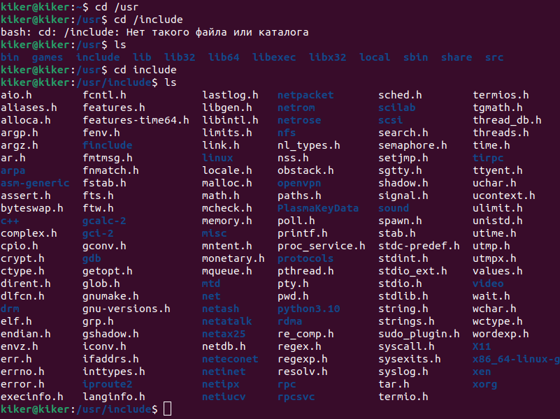

2.2. (рис.  17) В домашнем каталоге создайте директорию ~/ski.plases.\

2.3. (рис. 18) Переместите файл equipment в каталог ~/ski.plases.\

2.4. Переименуйте файл ~/ski.plases/equipment в ~/ski.plases/equiplist.\

2.5. (рис. 20) Создайте в домашнем каталоге файл abc1 и скопируйте его в каталог ~/ski.plases, назовите его equiplist2.\

2.6. (рис. 21) Создайте каталог с именем equipment в каталоге ~/ski.plases.\
По какой-то причине, скриншот не сохранился. На следующем скрине (ниже) видно, что папка была создана.

2.7. (рис. 21) Переместите файлы ~/ski.plases/equiplist и equiplist2 в каталог ~/ski.plases/equipment.\

2.8. (рис. 22) Создайте и переместите каталог ~/newdir в каталог ~/ski.plases и назовите его plans.

## Пункт 3

Определите опции команды chmod (рис. 23, рис. 24), необходимые для того, чтобы присвоить перечисленным ниже файлам выделенные права доступа, считая, что в начале таких прав нет:\
3.1. drwxr--r-- ... australia\
3.2. drwx--x--x ... play\
3.3. -r-xr--r-- ... my_os\
3.4. -rw-rw-r-- ... feathers\

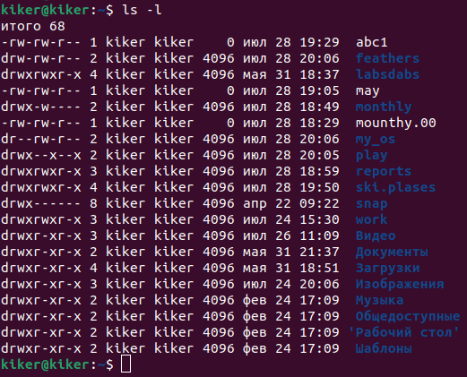

## Пункт 4

4.1. Просмотрите (рис. 25, рис. 26, рис. 27) содержимое файла /etc/password.\

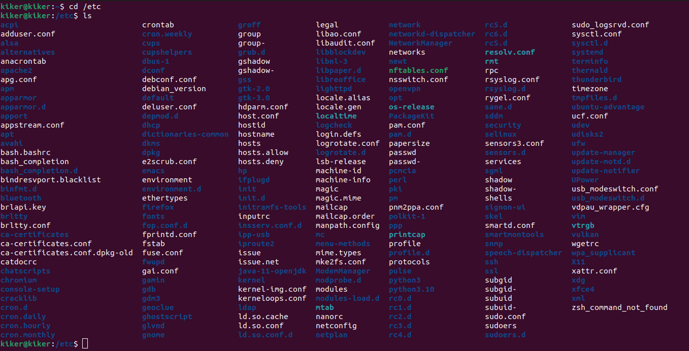

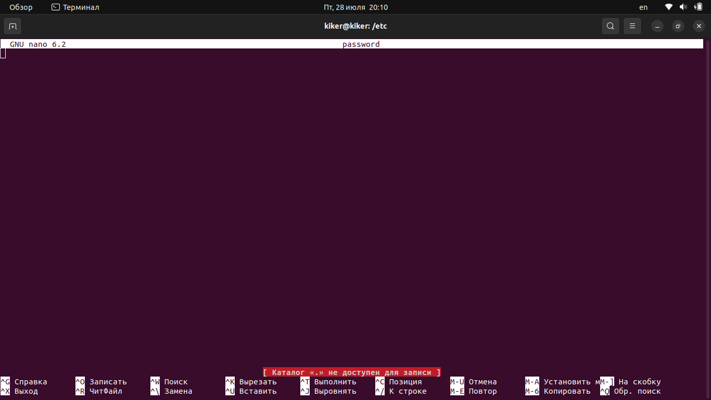

4.2. Скопируйте файл (рис. 28) ~/feathers в файл ~/file.old.\

4.3. Переместите файл (рис. 29) ~/file.old в каталог ~/play.\

4.4. Скопируйте каталог (рис. 30) ~/play в каталог ~/fun.\

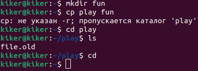

4.5. Переместите каталог (рис. 31) ~/fun в каталог ~/play и назовите его games.\

4.6. Лишите владельца файла (рис. 32) ~/feathers права на чтение.\

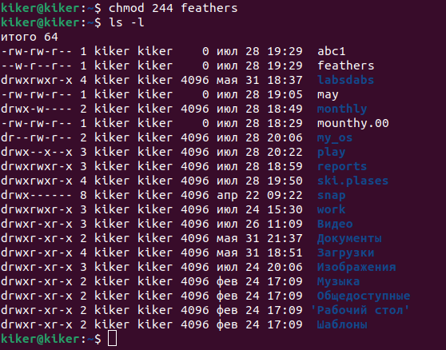

4.7. Что произойдёт (рис. 33), если вы попытаетесь просмотреть файл ~/feathers командой cat?\

4.8. Что произойдёт (рис. 34), если вы попытаетесь скопировать файл ~/feathers?\

4.9. Дайте владельцу файла ~/feathers право на чтение (рис. 35).\

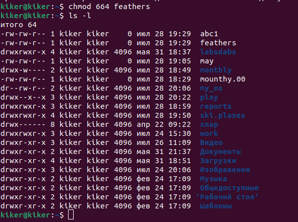

4.10. Лишите владельца каталога ~/play права на выполнение (рис. 36).\

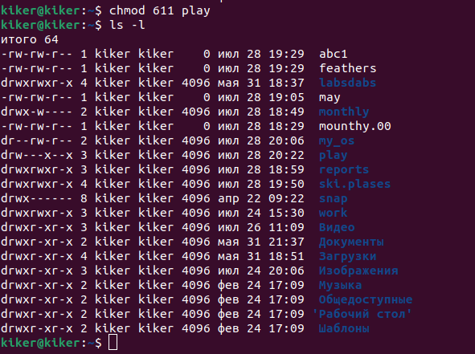

4.11. Перейдите в каталог (рис. 37) ~/play. Что произошло?\

4.12. Дайте владельцу каталога (рис. 38) ~/play право на выполнение.

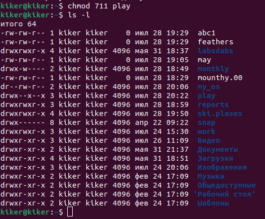

## Пункт 5

Прочитайте man по командам mount, fsck, mkfs, kill и кратко их охарактеризуйте, приведя примеры.

### mount

Команда mount предназначена для выполнения операции монтирования файловой системы и получения информации об уже смонтированных файловых системах.

Опции -h, -V используются при вызове команды без параметров и служат для следующих целей:

-h - вывести краткую инструкцию по пользованию командой;
-V - вывести информацию о версии команды mount;

Команда mount без опций и без параметров выводит информацию обо всех уже смонтированных файловых системах.

### fsck

fsck — это интерфейсная утилита, которая вызывает программу для проверки конкретной файловой системы. Команда Fsck обычно запускается после сбоя загрузки системы, повреждения файловой системы или сбоя в работе подключенного диска.

### mkfs

mkfs - создаёт новую файловую систему Linux  

mkfs используется для создания файловой системы Linux на некотором устройстве, обычно в разделе жёсткого диска. В качестве аргумента filesys для файловой системы может выступать или название устройства (например, /dev/hda1, /dev/sdb2) или точка монтирования (например, /, /usr, /home). Аргументом blocks указывается количество блоков, которые выделяются для использования этой файловой системой.

По окончании работы mkfs возвращает 0 - в случае успеха, а 1 - при неудачной операции. 

### kill

Команда kill является встроенной командой командной оболочки, предназначенной для отправки системных сигналов определенным процессам. Команда принимает числовые идентификаторы процессов, а также числовые или текстовые идентификаторы сигналов. Чаще всего данная команда используется для принудительного завершения работы определенных процессов.

kill [параметры] идентификатор-процесса

Команда поддерживает ряд параметров командной строки. Наиболее полезным параметром является параметр -s, позволяющий указать системный сигнал, который может быть отправлен заданному процессу, а также параметр -l, позволяющий вывести список поддерживаемых системных сигналов. 

# Выводы

В данной лабораторной работе я ознакомилась с файловой системой Linux, её структурой, именами и содержанием каталогов, приобрела практические навыки по применению команд для работы с файлами и каталогами, по управлению процессами (и работами), по проверке использования диска и обслуживанию файловой системы.

# Контрольные вопросы
1. Дайте характеристику каждой файловой системе, существующей на жёстком диске компьютера, на котором вы выполняли лабораторную работу.\
Ext2, Ext3, Ext4 или Extended Filesystem - это стандартная файловая система для Linux. Она была разработана еще для Minix. Она самая стабильная из всех существующих, кодовая база изменяется очень редко и эта файловая система содержит больше всего функций. 

JFS или Journaled File System была разработана в IBM для AIX UNIX и использовалась в качестве альтернативы для файловых систем ext. Сейчас она используется там, где необходима высокая стабильность и минимальное потребление ресурсов.

ReiserFS - была разработана намного позже, в качестве альтернативы ext3 с улучшенной производительностью и расширенными возможностями.

XFS - это высокопроизводительная файловая, изначально рассчитанная на файлы большого размера, и поддерживала диски до 2 Терабайт. 

Btrfs или B-Tree File System - это совершенно новая файловая система, которая сосредоточена на отказоустойчивости, легкости администрирования и восстановления данных. 

2. Приведите общую структуру файловой системы и дайте характеристику каждой директории первого уровня этой структуры.\
/ — root каталог. Содержит в себе всю иерархию системы;

/bin — здесь находятся двоичные исполняемые файлы. Основные общие команды, хранящиеся отдельно от других программ в системе (прим.: pwd, ls, cat, ps);

/boot — тут расположены файлы, используемые для загрузки системы (образ initrd, ядро vmlinuz);

/dev — в данной директории располагаются файлы устройств (драйверов). С помощью этих файлов можно взаимодействовать с устройствами. К примеру, если это жесткий диск, можно подключить его к файловой системе. В файл принтера же можно написать напрямую и отправить задание на печать;

/etc — в этой директории находятся файлы конфигураций программ. Эти файлы позволяют настраивать системы, сервисы, скрипты системных демонов;

/home — каталог, аналогичный каталогу Users в Windows. Содержит домашние каталоги учетных записей пользователей (кроме root). При создании нового пользователя здесь создается одноименный каталог с аналогичным именем и хранит личные файлы этого пользователя;

/lib — содержит системные библиотеки, с которыми работают программы и модули ядра;

/lost+found — содержит файлы, восстановленные после сбоя работы системы. Система проведет проверку после сбоя и найденные файлы можно будет посмотреть в данном каталоге;

/media — точка монтирования внешних носителей. Например, когда вы вставляете диск в дисковод, он будет автоматически смонтирован в директорию /media/cdrom;

/mnt — точка временного монтирования. Файловые системы подключаемых устройств обычно монтируются в этот каталог для временного использования;

/opt — тут расположены дополнительные (необязательные) приложения. Такие программы обычно не подчиняются принятой иерархии и хранят свои файлы в одном подкаталоге (бинарные, библиотеки, конфигурации);

/proc — содержит файлы, хранящие информацию о запущенных процессах и о состоянии ядра ОС;

/root — директория, которая содержит файлы и личные настройки суперпользователя;

/run — содержит файлы состояния приложений. Например, PID-файлы или UNIX-сокеты;

/sbin — аналогично /bin содержит бинарные файлы. Утилиты нужны для настройки и администрирования системы суперпользователем;

/srv — содержит файлы сервисов, предоставляемых сервером (прим. FTP или Apache HTTP);

/sys — содержит данные непосредственно о системе. Тут можно узнать информацию о ядре, драйверах и устройствах;

/tmp — содержит временные файлы. Данные файлы доступны всем пользователям на чтение и запись. Стоит отметить, что данный каталог очищается при перезагрузке;

/usr — содержит пользовательские приложения и утилиты второго уровня, используемые пользователями, а не системой. Содержимое доступно только для чтения (кроме root). Каталог имеет вторичную иерархию и похож на корневой;

/var — содержит переменные файлы. Имеет подкаталоги, отвечающие за отдельные переменные. Например, логи будут храниться в /var/log, кэш в /var/cache, очереди заданий в /var/spool/ и так далее.

3. Какая операция должна быть выполнена, чтобы содержимое некоторой файловой системы было доступно операционной системе?\
Монтирование (mount).

4. Назовите основные причины нарушения целостности файловой системы. Как устранить повреждения файловой системы?\
Целостность файловой системы восстаналивается с помощью команды fsck.

Отсутствие синхронизации между образом файловой системы в памяти и ее данными на диске в случае аварийного останова может привести к появлению следующих ошибок:

Один блок адресуется несколькими mode (принадлежит нескольким файлам).\
Блок помечен как свободный, но в то же время занят (на него ссылается onode).\
Блок помечен как занятый, но в то же время свободен (ни один inode на него не ссылается).\
Неправильное число ссылок в inode (недостаток или избыток ссылающихся записей в каталогах).\
Несовпадение между размером файла и суммарным размером адресуемых inode блоков.\
Недопустимые адресуемые блоки (например, расположенные за пределами файловой системы).\
"Потерянные" файлы (правильные inode, на которые не ссылаются записи каталогов).\
Недопустимые или неразмещенные номера inode в записях каталогов.

5. Как создаётся файловая система?\
mkfs - позволяет создать файловую систему Linux.

6. Дайте характеристику командам, которые позволяют просмотреть текстовые файлы.\
Cat - выводит содержимое файла на стандартное устройство вывода, еще читать можно через nano, mc.

7. Приведите основные возможности команды cp в Linux.\
Команда cp копирует файл или каталог, указанный в параметре Исходный_файл или Исходный_каталог, в файл или каталог, заданный в параметре Целевой_файл или Целевой_каталог.\
Если Целевой_файл существует, то его содержимое заменяется без предупреждения. При копировании нескольких Исходных_файлов должен быть указан целевой каталог.\
Если файл с указанным именем уже существует в целевом каталоге, то его содержимое будет заменено на содержимое исходного файла. В связи с этим рекомендуется указывать новое имя для копии файла, чтобы в целевом каталоге не было файла с тем же именем.

8. Назовите и дайте характеристику командам перемещения и переименования файлов и каталогов.\
Команда mv используется для перемещения одного или нескольких файлов (или директорий) в другую директорию, а также для переименования файлов и директорий.

mv опции исходные_файлы куда

исходные_файлы — это то, что мы будем перемещать или переименовывать. То есть это либо один файл, либо несколько файлов, либо директория, либо несколько директорий.

куда — это название директории, в которую мы перемещаем исходные файлы или директории. Или же это новое название файла или директории, если выполняется переименование. То есть это либо директория, либо новое название файла или директории.

9. Что такое права доступа? Как они могут быть изменены?\
Права доступа к файлу или каталогу можно изменить, воспользовавшись командой chmod. Сделать это может владелец файла (или каталога) или пользователь с правами администратора.