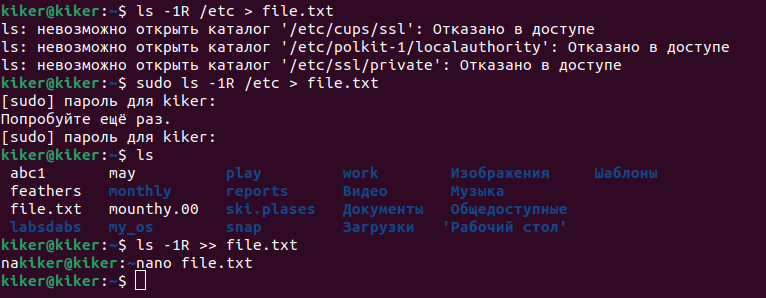
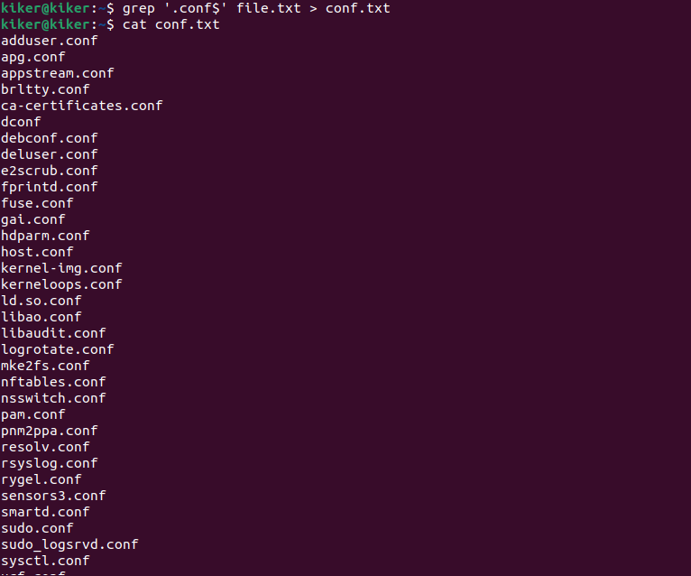
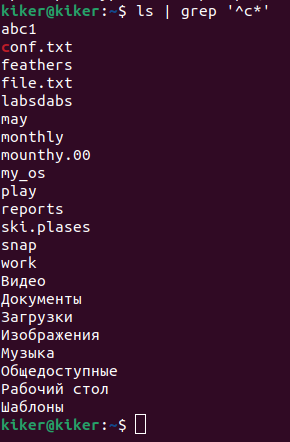
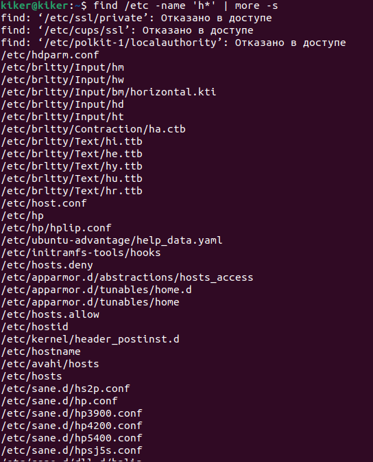
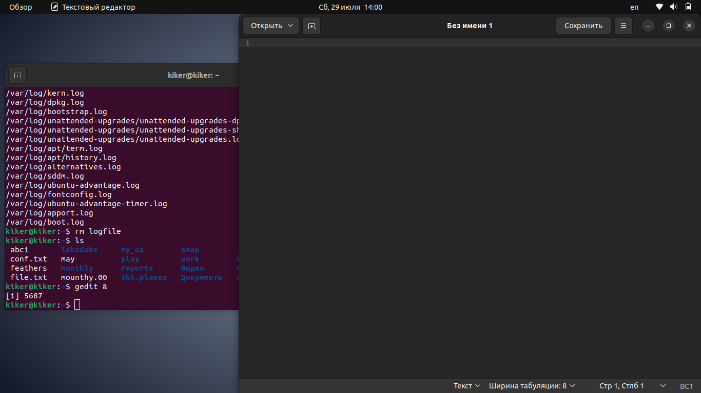
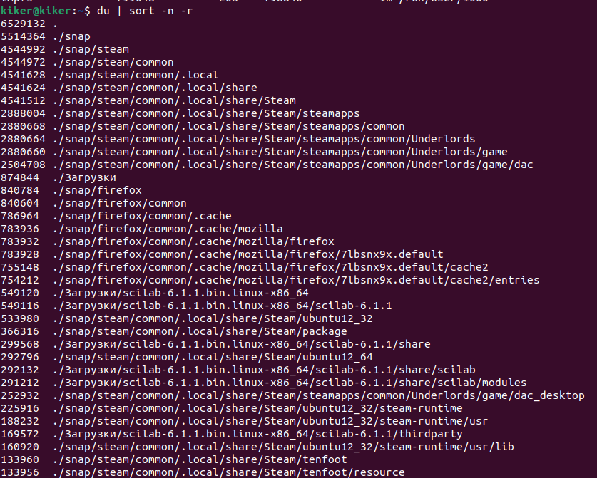
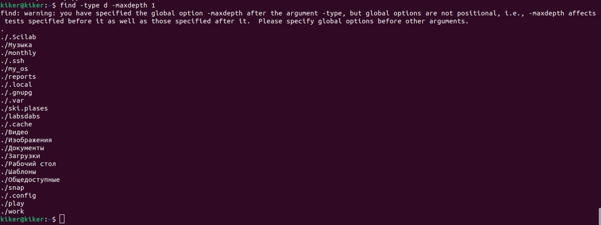

---
## Front matter
title: "Лабораторная работа №7 по предмету Операционные системы"
subtitle: "Группа НПМбв-02-19"
author: "Воронцов Павел Васильевич"

## Generic otions
lang: ru-RU
toc-title: "Содержание"

## Bibliography
bibliography: bib/cite.bib
csl: pandoc/csl/gost-r-7-0-5-2008-numeric.csl

## Pdf output format
toc: true # Table of contents
toc-depth: 2
lof: true # List of figures
lot: true # List of tables
fontsize: 12pt
linestretch: 1.5
papersize: a4
documentclass: scrreprt
## I18n polyglossia
polyglossia-lang:
  name: russian
polyglossia-otherlangs:
  name: english
## I18n babel
babel-lang: russian
babel-otherlangs: english
## Fonts
mainfont: PT Serif
romanfont: PT Serif
sansfont: PT Sans
monofont: PT Mono
mainfontoptions: Ligatures=TeX
romanfontoptions: Ligatures=TeX
sansfontoptions: Ligatures=TeX,Scale=MatchLowercase
monofontoptions: Scale=MatchLowercase,Scale=0.9
## Biblatex
biblatex: true
biblio-style: "gost-numeric"
biblatexoptions:
  - parentracker=true
  - backend=biber
  - hyperref=auto
  - language=auto
  - autolang=other*
  - citestyle=gost-numeric
## Pandoc-crossref LaTeX customization
figureTitle: "Рис."
tableTitle: "Таблица"
listingTitle: "Листинг"
lofTitle: "Список иллюстраций"
lotTitle: "Список таблиц"
lolTitle: "Листинги"
## Misc options
indent: true
header-includes:
  - \usepackage{indentfirst}
  - \usepackage{float} # keep figures where there are in the text
  - \floatplacement{figure}{H} # keep figures where there are in the text
---

# Цель работы

Ознакомление с инструментами поиска файлов и фильтрации текстовых данных. Приобретение практических навыков: по управлению процессами (и заданиями), по проверке использования диска и обслуживанию файловых систем.

# Задание

1. Осуществите вход в систему, используя соответствующее имя пользователя.
2. Запишите в файл file.txt названия файлов, содержащихся в каталоге /etc. Допишите в этот же файл названия файлов, содержащихся в вашем домашнем каталоге.
3. Выведите имена всех файлов из file.txt, имеющих расширение .conf, после чего запишите их в новый текстовой файл conf.txt.
4. Определите, какие файлы в вашем домашнем каталоге имеют имена, начинавшиеся с символа c? Предложите несколько вариантов, как это сделать.
5. Выведите на экран (по странично) имена файлов из каталога /etc, начинающиеся с символа h.
6. Запустите в фоновом режиме процесс, который будет записывать в файл ~/logfile файлы, имена которых начинаются с log.
7. Удалите файл ~/logfile.
8. Запустите из консоли в фоновом режиме редактор gedit.
9. Определите идентификатор процесса gedit, используя команду ps, конвейер и фильтр grep. Можно ли определить этот идентификатор более простым способом?
10. Прочтите справку (man) команды kill, после чего используйте её для завершения процесса gedit.
11. Выполните команды df и du, предварительно получив более подробную информацию об этих командах, с помощью команды man.
12. Воспользовавшись справкой команды find, выведите имена всех директорий, имеющихся в вашем домашнем каталоге.

# Выполнение лабораторной работы
Запишите в файл file.txt названия файлов, содержащихся в каталоге /etc. Допишите в этот же файл названия файлов, содержащихся в вашем домашнем каталоге.

Для записи /etc в file.txt и файлов домашнего каталога (рис.1):

```
sudo ls -1R /etc > file.txt
ls -1R >> file.txt
```

sudo нужно для первой команды, так как без нее в /etc не дает выполнить команду.



На рис.2 видно, где в созданном файле заканчивается перечисление файлов и подкаталогов /etc и начинается перечисление файлов и подкаталогов домашнего каталога.


Выведите имена всех файлов из file.txt, имеющих расширение .conf, после чего запишите их в новый текстовой файл conf.txt.

Использую grep для этого (рис.3).

 После grep указана маска для поиска в file.txt файлов с расширением .conf.

```
grep '.conf$' file.txt > conf.txt
```



Определите, какие файлы в вашем домашнем каталоге имеют имена, начинавшиеся с символа c? Предложите несколько вариантов, как это сделать.

Я использовала три команды (рис.4-6):

```
ls -d c* (1)
find . -type f -name 'c*' (2)
ls | grep '^c*' (3)
```


1: выведет файлы в текущем каталоге начинающиеся с 'c'


2: выведет полный путь к файлам из всех подкаталогов текущего каталога, начинающимся с 'c'



3: выведет список файлов и подкаталогов текущего каталога и подсветит нужные файлы

Выведите на экран (по странично) имена файлов из каталога /etc, начинающиеся с символа h.

Использую команду:

```
find /etc -name 'h*' | more -s
```

Здесь more это команда постраничного вывода.

Но моя команда выводит не только названия файлов в каталоге /etc, но и файлы из подкаталогов /etc (рис.7) и их пути



Запустите в фоновом режиме процесс, который будет записывать в файл ~/logfile файлы, имена которых начинаются с log (рис.8)

На рис. 8 и терминал с командой, и просмотр logfile.

```
find /var/log -name "*.log" -print > logfile &
```


Удалите файл ~/logfile (рис.9)


Запустите из консоли в фоновом режиме редактор gedit (рис.10)

На рис. 10 и запуск команды в консоли gedit &, и открывшееся окно текстовой редактора.



Определите идентификатор процесса gedit, используя команду ps, конвейер и фильтр grep. Можно ли определить этот идентификатор более простым способом? (рис. 11)

Можно либо найти из списка после вызова команды ps aux, либо отфильтровать еще с помощью grep по имени процесса (рис.11). Еще проще вряд ли можно.


Прочтите справку (man) команды kill, после чего используйте её для завершения процесса gedit (рис.12)

kill PID, где PID это номер процесса, который мы нашли в прошлом пункте.


Выполните команды df и du, предварительно получив более подробную информацию об этих командах, с помощью команды man (рис. 13-14)

df показывает информацию о файловых системах, сколько занято пространства в них, и о точках монтирования (рис.13)


du показывает информацию о занятом пространстве в байтах (рис.14)



Воспользовавшись справкой команды find, выведите имена всех директорий, имеющихся в вашем домашнем каталоге (рис.15)

-type d -- тип для вывода - директория (каталог)

-maxdepth 1 -- глубина вывода содержимого, в данном случае выведет только подкаталоги и не будет выводить то, что внутри подкаталогов

```
find -type d -maxdepth 1
```



# Выводы

В ходе выполнения данной лабораторной работы я ознакомилась с инструментами поиска файлов и фильтрации текстовых файлов, приобрела практические навыки по управлению процессам и проверке использования диска и файловых систем.

# Контрольные вопросы

1. Какие потоки ввода вывода вы знаете?\
В Linux есть три стандартных потока ввода-вывода: stdin (стандартный поток ввода), stdout (стандартный поток вывода) и stderr (стандартный поток ошибок).

2. Объясните разницу между операцией > и >>.\
Операция ">" используется для перенаправления вывода команды в файл, заменяя содержимое файла новым выводом. Операция ">>" также перенаправляет вывод в файл, но не заменяет его содержимое, а дописывает новый вывод в конец файла.

3. Что такое конвейер?\
Конвейер (pipeline) в Linux - это последовательность команд, в которой вывод одной команды используется в качестве ввода следующей команды, а также для передачи вывода из одного процесса в другой. 

4. Что такое процесс? Чем это понятие отличается от программы?\
Процесс в операционной системе Linux - это экземпляр выполняющейся программы, который обладает собственными ресурсами, такими как память, файловые дескрипторы и стек вызовов. Программа же представляет собой набор инструкций, которые могут быть запущены в процессе выполнения.

5. Что такое PID и GID?\
PID (Process ID) - это уникальный числовой идентификатор, который присваивается каждому процессу в Linux. GID (Group ID) - это идентификатор группы, к которой относится процесс.

6. Что такое задачи и какая команда позволяет ими управлять?\
Задача в Linux - это единица работы, которую нужно выполнить в определенный момент времени. Команда для управления задачами - это "cron", который позволяет создавать и настраивать периодические задания в системе.

7. Найдите информацию об утилитах top и htop. Каковы их функции?\
Top и htop - это утилиты мониторинга процессов в Linux. Они отображают список запущенных процессов и позволяют отслеживать использование ресурсов системы, таких как центральный процессор (CPU) и оперативная память (RAM).

8. Назовите и дайте характеристику команде поиска файлов. Приведите примеры использования этой команды.\
   Команда поиска файлов в Linux называется "find". Она позволяет искать файлы и директории в файловой системе по различным параметрам, таким как имя, тип, размер, дата изменения и т.д. Примеры использования команды find:\
    Найти все файлы с расширением ".txt" в директории /home/user: find /home/user -name "*.txt"\
    Найти все файлы больше 10 МБ в директории /var/log: find /var/log -size +10M

9. Можно ли по контексту (содержанию) найти файл? Если да, то как?\
Да, можно искать файлы по содержанию. Для этого используется команда "grep". Например, чтобы найти все файлы, содержащие слово "error", в директории /var/log, нужно выполнить следующую команду: grep -r "error" /var/log

10. Как определить объем свободной памяти на жёстком диске?\
Чтобы определить объем свободной памяти на жестком диске в Linux, можно использовать команду "df". Она отображает информацию о доступном месте на файловых системах. Команда df без параметров покажет информацию по всем файловым системам. Например: df -h.

11. Как определить объем вашего домашнего каталога?\
Чтобы определить объем своего домашнего каталога в Linux, можно использовать команду "du". Она позволяет посчитать размер файлов и директорий в указанной директории. Чтобы посчитать размер домашней директории, нужно выполнить следующую команду: du -sh ~/

12. Как удалить зависший процесс?\
Чтобы удалить зависший процесс в Linux, можно воспользоваться командой "kill". Сначала нужно определить PID с помощью команды ps aux.